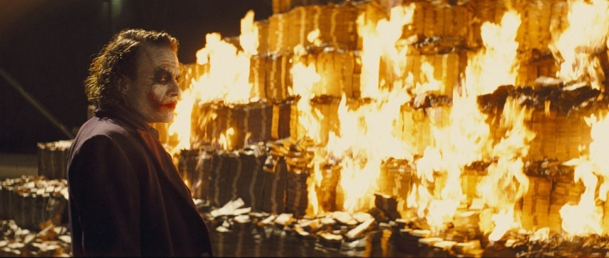
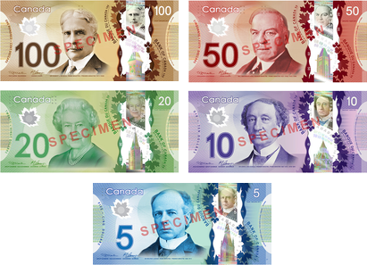
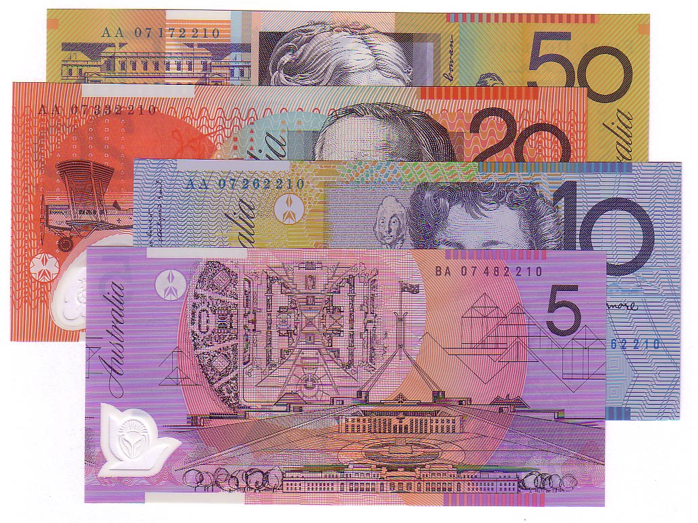
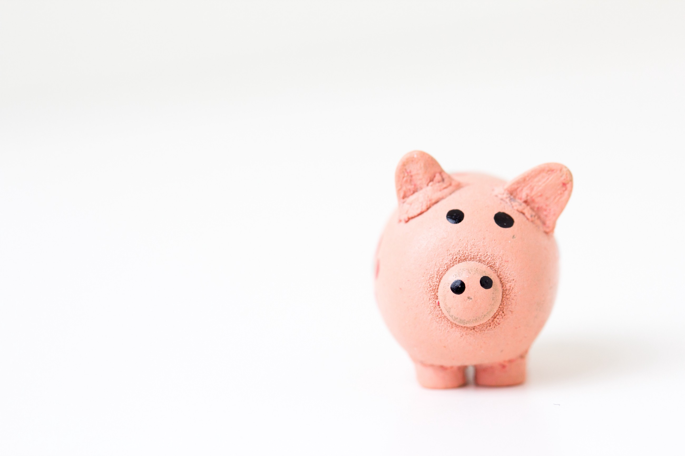

> It has been announced that the United States is going put a woman on the dollar,
> replacing Alexander Hamilton by 2020

Many people have praised this recent announcement as a wonderfully progressive action while there have been some that have been calling this an attack on some of the nations oldest traditions. _Well, I’m not here to talk about any of that._

This story has simply given me an opportunity to be reminded of why the American dollar actually sucks. Not in the sense that there are only men represented on the bills, but in the sense that **the design of the dollar bill is horrendous.**

> The US dollar needs an upgrade

I would like to take a moment attempt to convince everyone the design of United States currency is horrible and it should actually be changed even further than just making a female as one of the face on one of the bills. **So, here is a list of all the things that should also be changed on the American dollar.**

## 1. Colors

**Having one color doesn’t really serve any purpose when you think about it.** Imagine your wallet is full of cash and you want to pay for an order. You have a large number of different bills, but you are looking for very specific denominations. This is a somewhat frustrating process to deal with, but with a simple change of colors you would be capable of finding exactly what type of bill you happened to need a lot easier. It would be a lot nicer to know that a blue bill is a 5 and a red bill is a 50.

Look at the Canadian bills:

<!-- _Colors help us differentiate our bills_ -->

or even the Australian bills:

## 2. Size

This simple change would allow for easy **sorting of bills**. Not only that, but the United States as a nation would actually help the **blind**. Currently, the blind have no way of telling apart any of their bills when they are making a transaction. They have to simply trust that the people that are handing them their money aren’t swindling them. One argument against the change of size could be the issues it has when you’re dealing with vending machines occasionally, but if that was the case then it’s really easy to just add one change.

## 3. Braille

While different sizes could be a pretty drastic change that would be somewhat hard to implement without large scale ramifications across many different industries, braille would not be nearly as drastic. **Not only that but we wouldn’t be outcasting all of the blind with our decision either.** Looking back at the above pictures, Canada has adopted a braille system on their bills while Australia actually has different size bills.

## 4. Durability

It’s a pretty stone-age issue to deal with when I have to check my jeans every time I put them in the washer. If I wash a twenty dollar bill, there is a decent chance that it can get completely destroyed. Canadians actually test for counterfeit bills by attempting to rip the bills that are given to them. **You can’t rip up a Canadian or Australian bill**. It is so durable that it has no issue with getting torn to shreds in your washing machine because it’s actually made of a very powerful polymer. Not only does this prevent destruction, it also has a smaller environmental impact because they last so much longer.

## 5. Design

Finally the United States bill is simply designed horribly. It has no coherent font family, distasteful filigree, and extensive insignias and symbols strewn about the whole bill. It’s horrendous and, by my count, the final nail in the horrific design coffin that is the United States bill.

After taking in a couple of these points, hopefully you can go on and realize those bills in your pocket just look awful. Maybe as we move through the future we can continue to make small incremental changes to the currency (such as changing the face on one of the bills)! Hopefully, one day down the road we will end up with beautiful bills that everyone is actually capable of using.

